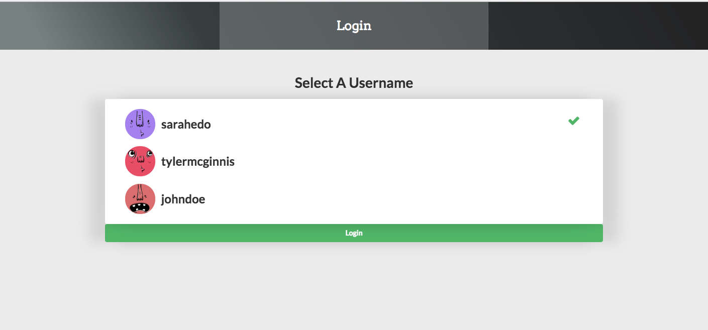
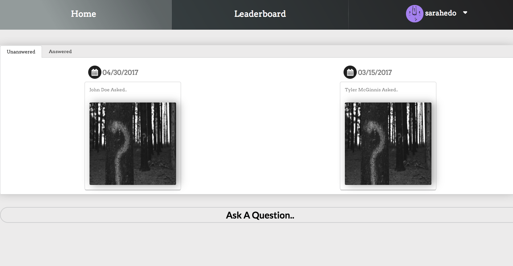
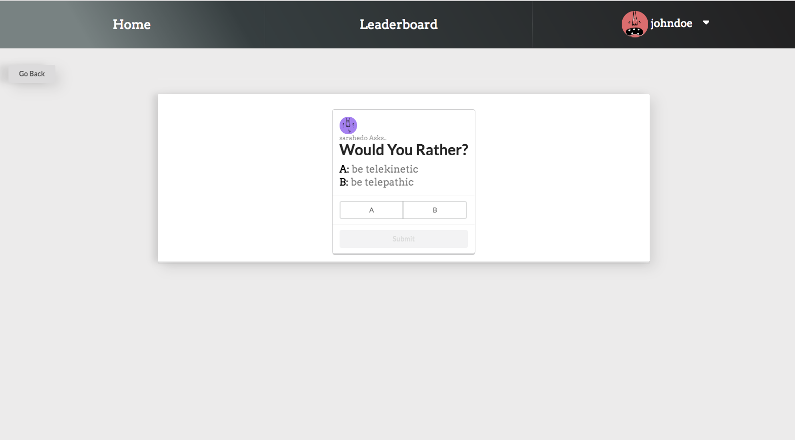
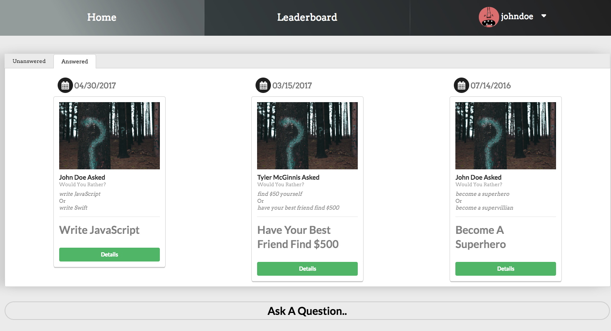
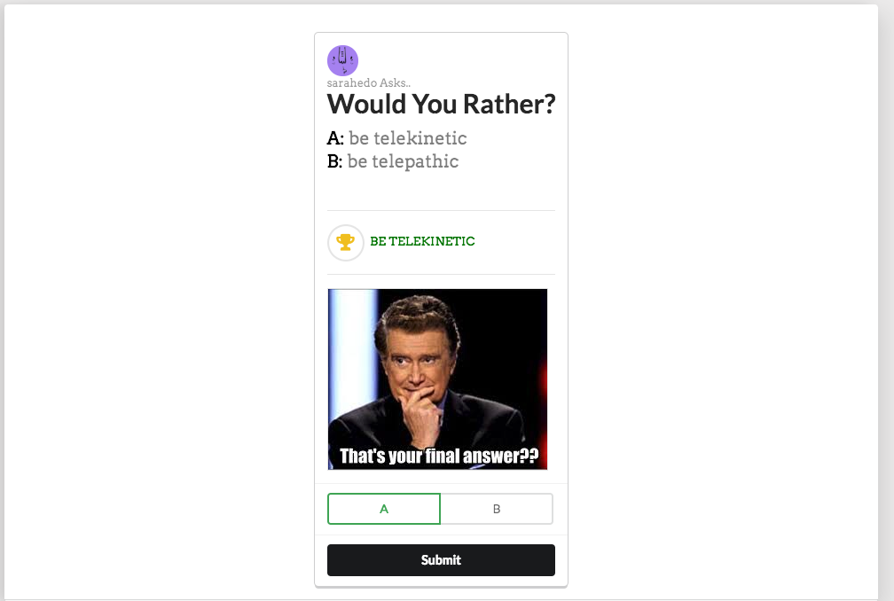
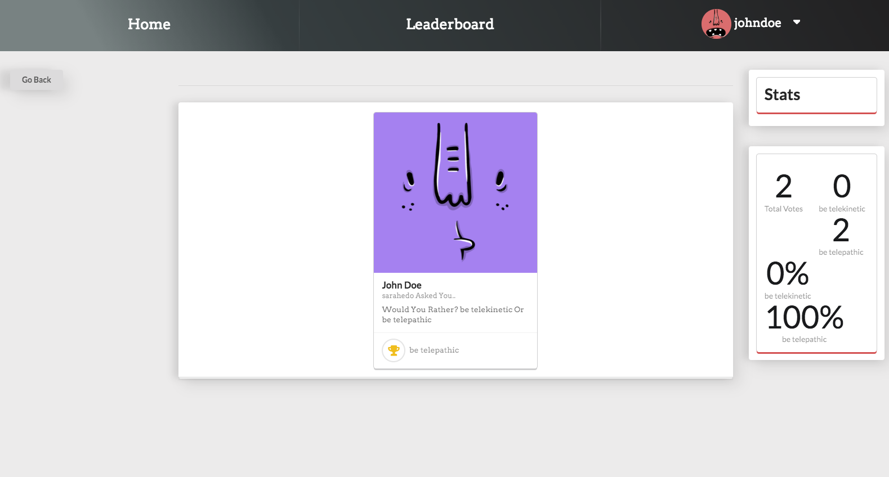
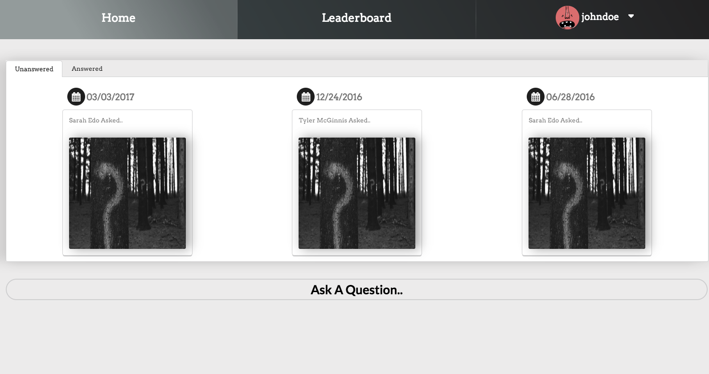
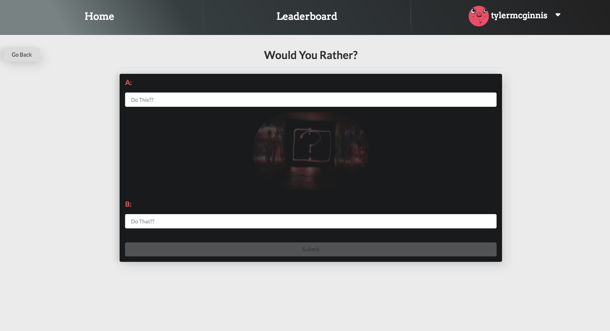
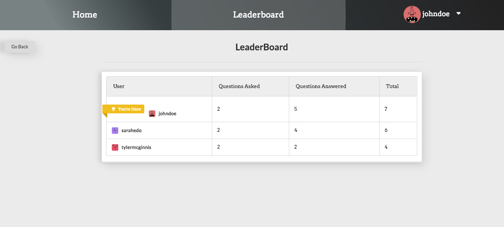

This project was bootstrapped with [Create React App](https://github.com/facebookincubator/create-react-app).

Below you will find some information on how to run, and play this Would_You_Rather Project. 
You can find the most recent version of the Create React App Guide [here](https://github.com/facebookincubator/create-react-app/blob/master/packages/react-scripts/template/README.md).

---

## GETTING STARTED WITH WOULDYOURATHER?

---

## **CLONE OR DOWNLOAD REPO**

> 1.  git clone https://github.com/Dmitri801/udacity_final_wouldyourather.git (or download by clicking download ZIP from the green button above)

---

## Move Into Repo

---

`cd udacity_final_wouldyourather`

## Install Dependancies

---

`npm install`

## Start Dev Server

---

`npm start`

# Playing The Game

## Logging In

- Click on a Username
- Click Login to activate - if you click away the login will deactivate... So click Again!

## Picking A Question/Home Page

### Click the question mark image to reveal the Unanswered question

## Click the Answered Tab, to show the answered questions

## Answering A Question/ Question Details

### Select A or B for your answer..

### Click Submit/Final Answer to submit your final answer!

## Post A New Question

### Click Ask A Question.. at the bottom of the home page to ask a new question, or click your user icon at the top Navbar.

### Both Questions are required to submit, must be more than 5 characters per question

## LeaderBoard

### Ranks by sum of questions asked, and answered.. START ASKING AND ANSWERING

# HAVE FUN!!
